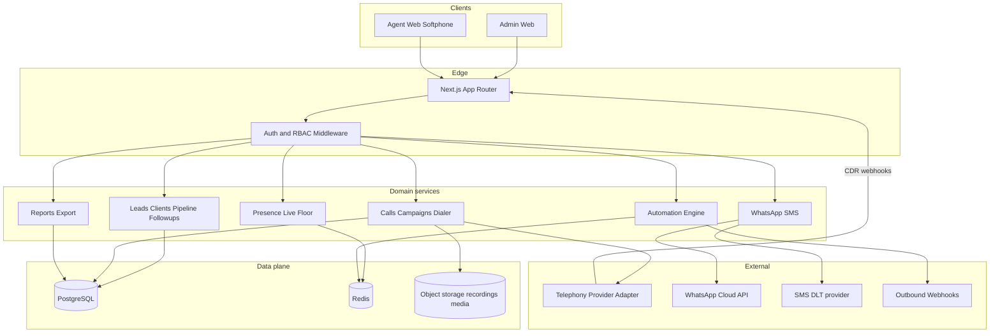

# Calling CRM — System Architecture

**Document ID:** `02-system-architecture`  
**Audience:** Architects, coding agents  
**Status:** Final blueprint for a production-ready base  
**Companion docs:** [01-product-requirements.md](./01-product-requirements.md), [03-module-specs-and-build-guide.md](./03-module-specs-and-build-guide.md)

---

## 1. Goals of this architecture

Provide a **strong production base** that:

- Separates Admin and Agent portals with shared auth/RBAC.
- Enforces menu + permission + data-scope on every request.
- Isolates telephony behind a **provider adapter** (swap Exotel / Plivo / Twilio / SIP without rewriting CRM).
- Uses proven TypeScript full-stack patterns suitable for Next.js App Router.
- Is multi-tenant-ready (domain branding) from day one.

---

## 2. High-level system diagram



---

## 3. Recommended stack (locked for coding agents)

| Layer | Choice | Rationale |
|-------|--------|-----------|
| App | **Next.js App Router** + React + TypeScript | RSC where possible; small client islands for softphone/Live Floor |
| UI | Tailwind CSS + accessible component primitives (shadcn/Radix style) | Consistent admin/agent UI |
| URL state | `nuqs` for list filters | Shareable filtered views |
| ORM / DB | **Prisma** + **PostgreSQL** | Relational integrity for RBAC, leads, CDR, ledger |
| Cache / realtime | **Redis** | Presence, dialer pacing, rate limits, job queues |
| Auth | JWT access (short) + refresh in **httpOnly cookies**; `jose` or equivalent | Secure browser sessions |
| Passwords | `bcrypt` / `argon2` | Never store plaintext |
| Jobs | Redis-backed worker (BullMQ or equivalent) | Import, automation, report email |
| Files | S3-compatible storage | Recordings, logos, imports |
| Validation | Zod | Shared request/response schemas |
| Telephony | **Adapter interface**; default India adapter target **Exotel** | Swap providers without CRM rewrite |

**Do not** use Payload CMS as the calling core. Payload may later power marketing content only if needed; CRM/voice stay in Prisma domain models.

---

## 4. Repository layout (suggested)

```text
src/
  app/
    (admin)/admin/...          # Admin portal routes
    (agent)/agent/...          # Agent portal routes
    api/v1/...                 # REST route handlers
    login/admin/ page
    login/agent/ page
  components/
    admin/ agent/ shared/ softphone/ live-floor/
  lib/
    auth/                      # session, cookies, MFA
    rbac/                      # menus, permissions, scope
    db/                        # prisma client
    telephony/                 # adapter + providers
    messaging/                 # wa / sms
    audit/
    validators/
  server/
    services/                  # domain services
    jobs/
prisma/
  schema.prisma
  seed.ts
docs/
  01-product-requirements.md
  02-system-architecture.md
  03-module-specs-and-build-guide.md
```

Route groups keep admin and agent layouts separate while sharing libraries.

---

## 5. Multi-tenancy and branding

### 5.1 Model

v1 may run **one company per deployment**, but schema and request context must include `companyId`.

Resolve tenant by:

1. `Host` / configured domain map, **or**
2. Explicit header `X-Company-Domain` (Baazexcall parity for white-label), **or**
3. Subdomain slug.

### 5.2 Company fields

`id`, `name`, `domainUrl`, `adminDomain`, `logoUrl`, `timezone` (default `Asia/Kolkata`), `dailyAutoAssign`, `validityUntil`, `settingsJson` (recording consent, DND, branding colors).

All business tables carry `companyId` and queries **always** filter by it.

---

## 6. Auth architecture

### 6.1 Login modes

| Portal | Identifier | Notes |
|--------|------------|-------|
| Admin | `email` + password | MFA required for Admin/Super Admin |
| Agent | `username` + password | MFA optional later |

### 6.2 Session

1. Validate credentials + `userStatus=active` + company validity.
2. Issue `accessToken` (5–15 min) + `refreshToken` (rotating, longer TTL).
3. Store tokens in **httpOnly**, `Secure`, `SameSite=Lax` cookies (separate cookie names per portal if same site).
4. On refresh failure / `SESSION_INVALID`: clear cookies, redirect to login.
5. Audit login success and failure (IP, user-agent).

### 6.3 Request context

After auth middleware, attach:

```ts
{
  userId: string
  companyId: string
  portal: "admin" | "agent"
  roleId: string
  permissions: Set<string>
  menuKeys: Set<string>
  dataScope: "ALL" | "TEAM" | "OWN"
  teamIds: string[]
}
```

---

## 7. RBAC enforcement

### 7.1 Resolution order

1. Load role menus + role permissions.
2. Apply `user_menu_overrides` / `user_permission_overrides` (grant or revoke).
3. Cache resolved sets in Redis keyed by `userId` + version; bust on role edit.

### 7.2 Checks

- **Page guard:** user must have menu key for route.
- **API guard:** `requirePermission("leads.export")` etc.
- **Scope guard:** apply Prisma `where` for OWN/TEAM/ALL.
- **Deny by default** if permission missing.

### 7.3 Critical rule

Hiding a sidebar item is **not** security. Every handler must call RBAC helpers.

---

## 8. Logical data model

### 8.1 Identity and access

| Entity | Key fields |
|--------|------------|
| `Company` | branding, domains, settings, dailyAutoAssign |
| `User` | email?, username?, passwordHash, userType, status, extension, forwardNumber, outboundEnabled, companyId |
| `Role` | name, dataScope, isSystem |
| `Menu` | key, label, portal, route, parentKey, sortOrder, enabled |
| `RoleMenu` | roleId, menuKey |
| `RolePermission` | roleId, permissionKey |
| `UserMenuOverride` | userId, menuKey, effect GRANT\|REVOKE |
| `UserPermissionOverride` | userId, permissionKey, effect |
| `Team` | name, companyId |
| `TeamMember` | teamId, userId |
| `AgentPresence` | userId, status, since, campaignId?, leadId? (Redis primary; DB snapshot optional) |

`userType` values: `SUPER_ADMIN`, `ADMIN`, `SUPERVISOR`, `CALLER`, `AFFILIATE` (templates only; effective access from RBAC).

### 8.2 CRM core

| Entity | Key fields |
|--------|------------|
| `Lead` | phone (E.164), altPhones, name, email, source, campaignId, ownerId, status, responseId, responseType, isAssigned, assignedAt, dnd, customFields JSON, score |
| `LeadActivity` | leadId, type, payload, actorId, createdAt |
| `CustomFieldDef` | module, key, label, type, options |
| `PipelineStage` | name, sortOrder, isWon, isLost |
| `Deal` | leadId?, clientId?, stageId, value, expectedClose, lostReason |
| `FollowUp` | leadId/clientId, dueAt, assignedTo, status, note |
| `Disposition` | slotNumber, responseText, type carry_forward\|non_carry_forward, maps JSON |
| `Script` | name, stageId?, body, active |
| `Client` | fromLeadId?, name, phones, ownerId, meta |
| `ClientNote` | clientId, body, actorId |
| `LedgerEntry` | clientId, type deposit\|withdrawal\|adjustment, amount, currency, isFtd, createdBy, note |
| `Affiliate` | linked userId, status |

### 8.3 Voice and campaigns

| Entity | Key fields |
|--------|------------|
| `Campaign` | name, mode, status, callerIdNumberId, scriptId, hours JSON, pacing, retryRules |
| `CampaignAgent` | campaignId, userId |
| `CampaignLead` | campaignId, leadId, state |
| `DidNumber` | e164, direction, providerRef |
| `CallFlow` | name, graph JSON |
| `Queue` | name, strategy, timeout, moh |
| `Call` | direction, from, to, agentId, leadId, clientId, campaignId, didId, status, startedAt, answeredAt, endedAt, durationSec, dispositionId, recordingUrl, providerCallId |
| `Recording` | callId, storageKey, duration, retentionUntil |

### 8.4 Messaging, automation, audit

| Entity | Key fields |
|--------|------------|
| `MessageThread` | leadId/clientId, channel wa\|sms\|email |
| `Message` | threadId, direction, templateId?, body, status, providerId |
| `MessageTemplate` | channel, name, dltId?, body, variables |
| `AutomationRule` | trigger, conditions JSON, actions JSON, enabled |
| `WebhookEndpoint` | url, secret, events[] |
| `IntegrationCredential` | provider, encrypted secrets |
| `AuditLog` | actorId, action, entityType, entityId, meta JSON, ip, createdAt |
| `ApiKey` | hash, scopes, createdBy |

Indexes (minimum): `Lead(companyId, phone)`, `Lead(companyId, ownerId, assignedAt)`, `Call(companyId, startedAt)`, `Call(providerCallId)`, `LedgerEntry(clientId, createdAt)`, `AuditLog(companyId, createdAt)`.

---

## 9. Telephony adapter

### 9.1 Interface (conceptual)

```ts
interface TelephonyAdapter {
  clickToCall(input: { agentUserId: string; toNumber: string; fromDid?: string; leadId?: string }): Promise<{ providerCallId: string }>
  hangup(providerCallId: string): Promise<void>
  startRecording(providerCallId: string): Promise<void>
  getRecordingUrl(providerCallId: string): Promise<string | null>
  // Softphone
  createAgentSession(agentUserId: string): Promise<{ token: string; iceServers: unknown[] }>
  // Inbound / IVR hooks implemented via provider webhooks → normalize to domain events
}
```

### 9.2 Inbound webhook pipeline

1. Verify provider signature.
2. Normalize to domain events: `call.ringing`, `call.answered`, `call.ended`, `recording.ready`.
3. Upsert `Call` / `Recording`.
4. Publish presence update to Redis/WebSocket.
5. Fire automations.

### 9.3 Softphone

- Agent client obtains short-lived session token from API.
- Media path: provider WebRTC or SIP.js against adapter-configured endpoint.
- CRM owns disposition UI; telephony owns media.

### 9.4 Dev / test

Ship a **MockTelephonyAdapter** that simulates dial, durations, and CDR so CRM can be built without live DIDs.

---

## 10. Realtime (Live Floor + presence)

- Redis hash/set per company for agent presence.
- WebSocket (or SSE fallback) channel `company:{id}:floor`.
- Events: `presence.updated`, `call.started`, `call.ended`, `queue.stats`.
- Supervisor actions (`listen` / `whisper` / `barge`) call telephony adapter then audit.

---

## 11. API surface outline

Base: `/api/v1`  
Auth: cookie session (or `Authorization: Bearer` for integrations).  
All responses: `{ statusCode, code, message, data }` (Baazex-like envelope optional but consistent).

### 11.1 Auth

- `POST /auth/admin/login`
- `POST /auth/agent/login`
- `POST /auth/logout`
- `POST /auth/refresh`
- `POST /auth/reset-password`
- `GET /me`

### 11.2 RBAC admin

- `GET/POST /menus`, `GET/PATCH /roles`, `PUT /roles/:id/menus`, `PUT /roles/:id/permissions`
- `PUT /users/:id/menu-overrides`, `PUT /users/:id/permission-overrides`

### 11.3 CRM

- Leads CRUD, import, assign, merge, activities
- Clients CRUD, notes, ledger
- Dispositions CRUD
- Follow-ups CRUD
- Pipeline stages / deals
- Affiliates CRUD

### 11.4 Voice

- Calls list/get, click-to-call, disposition submit
- Campaigns CRUD + start/pause
- Numbers, call flows, queues
- Softphone session token
- Provider webhooks under `/webhooks/telephony/:provider`

### 11.5 Omni / ops

- WhatsApp/SMS send + inbox threads
- Reports endpoints (caller, affiliate, company, custom)
- Automation rules
- Audit list
- Integrations / API keys

### 11.6 Pagination

Default `page=1`, `limit=50`, allow `50|100|150|200` (Baazex parity). Always return `totalCount`, `totalPages`.

---

## 12. Security

| Control | Requirement |
|---------|-------------|
| Transport | HTTPS only in production |
| Passwords | Strong hash; reset flows time-limited |
| MFA | TOTP for admin portal privileged roles |
| Secrets | Env / secret manager; encrypt provider credentials at rest |
| PII | Mask phone in Live Floor if `calls.mask`; restrict ledger |
| Exports | Permission + audit |
| Recordings | Signed URLs; permission `recordings.play` / `download`; retention job |
| Rate limits | Login, click-to-call, SMS/WA send |
| CORS | Explicit origins for admin/agent domains |
| IDOR | Every query scoped by `companyId` + dataScope |

---

## 13. India compliance hooks

- Normalize phones to E.164 (`+91...`).
- DND flag on lead; dialer skips DND unless override permission.
- SMS only via DLT-registered templates when channel=IN.
- Recording consent notice configurable in Settings; store acknowledgment on call if required.
- Report timezones default IST; store UTC in DB.

---

## 14. Non-functional requirements

| Area | Target |
|------|--------|
| Agent next-lead / disposition API | p95 &lt; 300ms app-side (excluding PSTN) |
| Live Floor update latency | &lt; 2s typical |
| Availability | Design for multi-instance Next + managed PG/Redis |
| Observability | Structured logs, request id, error tracking, dialer metrics |
| Backups | Daily PG backups; recording lifecycle policy |
| Imports | Async job with progress for large CSV |

---

## 15. Environment variables (minimum)

```text
DATABASE_URL=
REDIS_URL=
JWT_ACCESS_SECRET=
JWT_REFRESH_SECRET=
COOKIE_DOMAIN=
S3_ENDPOINT= S3_BUCKET= S3_ACCESS_KEY= S3_SECRET_KEY=
TELEPHONY_PROVIDER=mock|exotel|...
TELEPHONY_API_KEY=
TELEPHONY_API_TOKEN=
WHATSAPP_ENABLED=false
SMS_ENABLED=false
APP_ADMIN_URL=
APP_AGENT_URL=
```

---

## 16. Production-ready base definition

A coding agent has delivered a **production-ready base** when:

1. Admin + Agent login work with httpOnly sessions.
2. Menu catalog + role assignment drive sidebar **and** API denials.
3. Parity modules (Leads, Callers, Affiliates, Responses, Today Calls, Call History, Clients+Ledger, Reports, Dashboard) are functional with seed data.
4. Mock telephony supports click-to-call + CDR write path.
5. Audit log captures logins, exports, role changes, ledger edits.
6. Prisma migrations + seed run cleanly on empty PostgreSQL.
7. Basic tests exist for RBAC deny and lead assign scope.

Enhancements (Live Floor media barge, real Exotel, WhatsApp, predictive dialer, AI) layer on this base per phases in doc 03.
