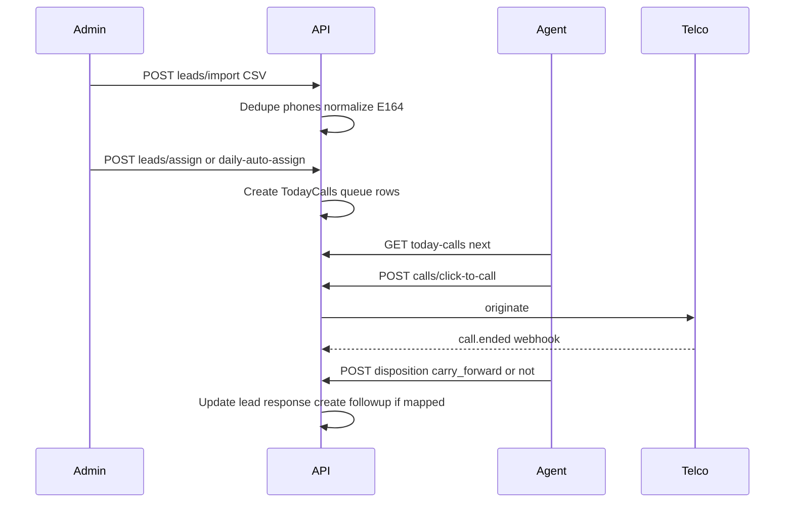

# Calling CRM — Module Specs and Build Guide

**Document ID:** `03-module-specs-and-build-guide`  
**Audience:** Coding agents (primary), tech leads  
**Status:** Final implementation blueprint  
**Companion docs:** [01-product-requirements.md](./01-product-requirements.md), [02-system-architecture.md](./02-system-architecture.md), [baazexcall-menu-lock.md](./baazexcall-menu-lock.md)

---

## 0. How a coding agent must use this document

1. Read doc 01 for *what*, doc 02 for *architecture*, this doc for *screens, fields, workflows, phases, DoD*.
2. Implement **Phase 0 → Phase 1 (parity)** before enhancement phases.
3. Every nav item shipped must have: route, permission check, list or detail UI, API, empty state — **no placeholder menus**.
4. Do not commit secrets or Baazexcall customer data.
5. Prefer early returns, TypeScript, named exports, Tailwind; no semicolons if project style requires it.

---

## 1. Permission matrix (role templates)

Legend: Y = grant by default, — = no.

### 1.1 Admin portal menus

| Menu key | Agent | Supervisor | Company Admin | Super Admin | Affiliate |
|----------|-------|------------|---------------|-------------|-----------|
| admin.dashboard | — | Y | Y | Y | Y* |
| admin.live_floor | — | Y | Y | Y | — |
| admin.leads | — | Y | Y | Y | Y* |
| admin.today_calls_monitor | — | Y | Y | Y | — |
| admin.pipeline | — | Y | Y | Y | — |
| admin.clients | — | Y | Y | Y | — |
| admin.follow_ups | — | Y | Y | Y | — |
| admin.campaigns | — | Y | Y | Y | — |
| admin.dialer | — | Y | Y | Y | — |
| admin.call_history | — | Y | Y | Y | — |
| admin.dispositions | — | — | Y | Y | — |
| admin.scripts | — | Y | Y | Y | — |
| admin.messaging | — | Y | Y | Y | — |
| admin.whatsapp | — | Y | Y | Y | — |
| admin.sms | — | Y | Y | Y | — |
| admin.numbers | — | — | Y | Y | — |
| admin.ivr | — | — | Y | Y | — |
| admin.queues | — | Y | Y | Y | — |
| admin.callers | — | Y | Y | Y | — |
| admin.affiliates | — | — | Y | Y | — |
| admin.admins | — | — | Y | Y | — |
| admin.teams | — | Y | Y | Y | — |
| admin.roles | — | — | Y | Y | — |
| admin.reports | — | Y | Y | Y | Y* |
| admin.automation | — | — | Y | Y | — |
| admin.integrations | — | — | Y | Y | — |
| admin.qa | — | Y | Y | Y | — |
| admin.audit | — | — | Y | Y | — |
| admin.settings | — | — | Y | Y | — |
| admin.billing | — | — | — | Y | — |

\*Affiliate sees only attributed data; use dedicated affiliate dashboard widgets if preferred.

### 1.2 Agent portal menus

| Menu key | Agent | Supervisor | Affiliate |
|----------|-------|------------|-----------|
| agent.dashboard | Y | Y | Y* |
| agent.softphone | Y | Y | — |
| agent.today_calls | Y | Y | — |
| agent.leads | Y | Y | Y* |
| agent.follow_ups | Y | Y | — |
| agent.call_history | Y | Y | — |
| agent.clients | Y | Y | — |
| agent.whatsapp | Y | Y | — |
| agent.scripts | Y | Y | — |
| agent.reports | Y | Y | Y* |
| agent.status | Y | Y | — |

### 1.3 Critical action permissions

| Permission | Agent | Supervisor | Admin |
|------------|-------|------------|-------|
| leads.view / create / update | OWN | TEAM | ALL |
| leads.import / assign / delete / export | — | limited | Y |
| today_calls.use | Y | Y | Y |
| calls.listen / whisper / barge | — | Y | Y |
| recordings.play | OWN | TEAM | ALL |
| recordings.download | — | Y* | Y |
| clients.ledger | OWN view* | TEAM view | ALL |
| clients.ledger.edit | — | — | Y |
| reports.export | — | Y | Y |
| roles.manage / menus.assign | — | — | Y |
| audit.view | — | — | Y |

\*Configurable per company.

Default **dataScope**: Agent=`OWN`, Supervisor=`TEAM`, Admin=`ALL`.

---

## 2. Seed data (must match Baazexcall behavior)

### 2.1 Default dispositions

| slotNumber | responseText | type |
|------------|--------------|------|
| 1 | Not Answer | carry_forward |
| 2 | Follow up | carry_forward |
| 3 | Registered | carry_forward |
| 4 | Not Reachable | non_carry_forward |
| 5 | Busy | carry_forward |
| 6 | Wrong Number | non_carry_forward |
| 7 | Not Interested | non_carry_forward |
| 8 | Callback | carry_forward |

### 2.2 Bootstrap users (dev only)

- Super Admin: `admin@example.com` / strong password from env  
- Demo Caller username: `agent1`  
- Demo Supervisor email: `supervisor@example.com`  
- Company: timezone `Asia/Kolkata`, `dailyAutoAssign=4` (Baazex sample)

### 2.3 Default menus

Seed full menu catalog from doc 01 §5; attach to roles per matrix above.

---

## 3. Critical end-to-end workflows

### 3.1 Lead import → assign → Today Calls → disposition



**Rules**

- If disposition `carry_forward`: keep lead eligible for future Today Calls / campaign retry per retry rules.
- If `non_carry_forward`: remove from active carry queue; retain history.
- Agent cannot fetch next lead while ACW disposition pending.

### 3.2 Convert to client + ledger FTD

1. Disposition “Registered” (or explicit Convert action) creates `Client` from lead.
2. First deposit ledger entry sets `isFtd=true` once per client.
3. Caller report increments `clientCreate`, `ftd`, deposit/withdrawal aggregates.
4. Ledger edit requires `clients.ledger.edit` + audit.

### 3.3 Supervisor Live Floor intervene

1. Supervisor opens Live Floor; WebSocket presence stream.
2. Choose agent on-call → Listen (permission) → adapter bridge.
3. Audit `calls.listen` with callId + supervisorId.

---

## 4. Screen-by-screen specifications

### 4.1 Shared UI patterns

- Page header: title, primary CTA, secondary actions.
- Filters row + debounced search; persist via `nuqs`.
- Data table: sortable columns, pagination 50/100/150/200.
- Empty state with CTA if permitted.
- Confirm dialogs for delete/disable.
- Toast on success/error; form field validation via Zod.
- Accessible controls: labels, keyboard, `aria-*`.

---

### 4.2 Admin — Login

- **Route:** `/login/admin`  
- **Fields:** email, password, optional MFA code  
- **Copy:** “Admin access only.”  
- **On success:** redirect `/admin`

### 4.3 Agent — Login

- **Route:** `/login/agent`  
- **Fields:** username, password  
- **Copy:** “User Panel” / “Enter your credentials to access the panel.”  
- **On success:** redirect `/agent`

---

### 4.4 Admin Dashboard — `/admin`

**Permission:** `dashboard.view`  
**Widgets**

- Stat cards: totalCalls, answered, missed, outbound, talkTime, uniqueLeads, ftd, conversion  
- Presence strip  
- Mini table: top callers today  
- Date range filter  

**API:** `GET /reports/dashboard?from&to`

---

### 4.5 Live Floor — `/admin/live-floor`

**Permission:** `admin.live_floor` + `calls.listen` for actions  
**UI:** responsive agent cards grid  

**Card fields:** name, status badge, timer, campaign, masked phone, lead name  

**Actions:** Listen, Whisper, Barge, Open lead  

**Empty:** “No agents online”

---

### 4.6 Leads — `/admin/leads`

**Permission:** `leads.view`  
**Columns:** phone, name, source, campaign, owner, status, response, responseType, assignedAt, updatedAt  
**Filters:** owner, status, campaign, source, responseType, isAssigned, date range, search phone/name  
**Actions:** Add, Import, Export, Bulk assign, Bulk disposition, Open 360, Merge duplicates  

**Create/Edit fields:** phone (required), name, email, source, campaign, owner, tags, custom fields, dnd  

**Import wizard:** upload → map columns → dry-run dedupe counts → commit job  

**Lead 360** `/admin/leads/[id]`: profile, numbers, timeline, follow-ups, deals, messages, calls, files, convert-to-client  

**API:** CRUD, `POST /leads/import`, `POST /leads/assign`, `POST /leads/daily-auto-assign`, `POST /leads/merge`

---

### 4.7 Today Calls Monitor — `/admin/today-calls`

Admin view of queues by agent: pending, completed, carry_forward counts.  
Drill into agent queue.

---

### 4.8 Pipeline — `/admin/pipeline`

Kanban by stage + list toggle. Drag card updates stage (permission `pipeline.update`).  
Card: lead/client name, value, owner, days in stage.

---

### 4.9 Clients — `/admin/clients`

**Columns:** name, phone, owner, createdAt, ftd, balance  
**Detail tabs:** Overview, Notes, Calls, Messages, **Ledger**, Files  

**Ledger table:** date, type, amount, isFtd, note, createdBy  
**Actions:** Add transaction (permission), Export ledger (audited)

**Parity APIs:** list, create, update, delete, notes, call, ledger, transaction, search-user

---

### 4.10 Follow-ups — `/admin/follow-ups`

List + calendar. Columns: dueAt, lead/client, assignee, status, note.  
Filters: overdue, today, range, assignee.

---

### 4.11 Campaigns — `/admin/campaigns`

**List:** name, mode, status, agents, leads remaining, connects  
**Detail:** settings form + lead membership + live stats  
**Modes:** preview, progressive, power, click_to_call  
**Actions:** Start, Pause, Recycle missed (carry_forward)

---

### 4.12 Dialer Control — `/admin/dialer`

Global pacing, calling hours, AMD toggle, wrap-up seconds, masking policy.  
Links into active campaigns.

---

### 4.13 Call History — `/admin/call-history`

**Columns:** time, direction, agent, from, to, duration, disposition, campaign, recording  
**Summary chips:** totalResponded, totalPending (Baazex parity)  
**Actions:** play recording, download, open lead/client  

**API:** `GET /calls` with filters

---

### 4.14 Responses — `/admin/responses`

Editable slots 1..N. Fields: slotNumber, responseText, type, mappings (follow-up offset, stage, template, convertClient).  
Validate unique slotNumber.

---

### 4.15 Scripts — `/admin/scripts`

Rich text / markdown script body; optional stage binding; preview for agents.

---

### 4.16 Messaging / WhatsApp / SMS

- Templates list (DLT id for SMS).  
- Inbox threads; send box disabled if channel not configured.  
- Bulk send wizard with audience filter.

---

### 4.17 Numbers / IVR / Queues

- **Numbers:** e164, label, inbound/outbound, assigned flow.  
- **IVR:** node graph editor (play, dtmf, queue, team, voicemail, hours, hangup, sms). Save as JSON graph.  
- **Queues:** strategy (ring_all, round_robin, least_recent), timeout, members.

---

### 4.18 Callers — `/admin/callers` (parity)

**Columns:** username/name, status, totalClients, createdAt  
**Actions:** Create, Reset password, Enable/Disable, Assign team, Assign menus (link to user overrides)  
**Create fields:** name, username, password, outboundEnabled, extension, forwardNumber, daily targets optional

---

### 4.19 Affiliates — `/admin/affiliates`

Same pattern as callers with affiliate report link. Status toggle + reset password.

---

### 4.20 Admins — `/admin/admins`

List company admins / supervisors. Create with email. Reset password. Optionally reset API key. Validity date if white-label SaaS.

---

### 4.21 Teams — `/admin/teams`

Team CRUD; member multi-select; used for TEAM data scope.

---

### 4.22 Roles & Menus — `/admin/roles` (**critical differentiator**)

1. List roles.  
2. Role detail: dataScope selector; checklist of menus by portal; checklist of permissions.  
3. User detail link: overrides GRANT/REVOKE.  
4. Save → bump RBAC cache version → audit.

**Acceptance:** removing `admin.leads` hides nav and returns 403 on `GET /leads`.

---

### 4.23 Reports — `/admin/reports`

Tabs: Caller | Affiliate | Company | Custom  

**Caller report columns (parity):** username, clientCreate, totalCallDone, followUpClient, ftd, totalDeposit, totalWithdrawal, dwRatio, responseCounters…  

Export CSV; schedule email (phase 2 ok).

---

### 4.24 Automation — `/admin/automation`

Rule list: trigger, status, lastRun. Editor: trigger → conditions → actions. Test-run dry mode.

---

### 4.25 Integrations — `/admin/integrations`

API keys, webhook endpoints, provider credentials forms (telephony, WhatsApp, SMS). Feature flags.

---

### 4.26 QA — `/admin/qa`

Queue of recordings to score; form scorecard; assign coaching task.

---

### 4.27 Audit — `/admin/audit`

Immutable list: time, actor, action, entity, meta. Filter by action/date/actor. No edit/delete in UI.

---

### 4.28 Settings — `/admin/settings`

Tabs: Company, Branding, Telephony, Compliance (consent, DND), Security (MFA, session, IP allowlist), Lead fields.

---

### 4.29 Agent Dashboard — `/agent`

Own stats + follow-ups due today + softphone status.

---

### 4.30 Softphone — `/agent/softphone`

Dial pad, call controls, active lead panel (screen-pop), disposition panel, ACW timer.  
Must request microphone permission with clear UX.

---

### 4.31 Today Calls — `/agent/today-calls` (parity)

**Primary agent screen.**

- Status control: Available / Break / Wrap-up  
- Current card: phone, name, script snippet, call button  
- After call: disposition radios (from admin responses), note, follow-up datetime, submit  
- List of remaining today numbers  
- **API parity:** status, get-numbers, list, response submit, admin responses list  

**Validation:** disposition required; if type maps to follow-up, dueAt required.

---

### 4.32 Agent Call History / My Clients / Reports

Scoped OWN versions of admin screens; no import/delete company-wide; ledger view if permitted.

---

### 4.33 Agent Status / Break

Break codes; punch in/out; shows idle warnings if configured.

---

## 5. Validation rules (global)

| Field | Rule |
|-------|------|
| Phone | Required on lead; normalize to E.164; unique per company unless merge |
| Email | Optional; valid format |
| Disposition type | Enum carry_forward \| non_carry_forward |
| Ledger amount | Decimal &gt; 0; currency default INR |
| Username | Unique per company; agent login |
| Email login | Unique globally or per company (pick per company) |
| CSV import | Max rows configurable (e.g. 50k); async above 1k |

---

## 6. Phased delivery and acceptance criteria

### Phase 0 — Foundation

**Deliver:** Next.js app, Prisma schema, auth admin+agent, menu catalog seed, RBAC middleware, audit log stub, MockTelephonyAdapter.

**AC**

- [ ] Admin and agent can log in; cookies httpOnly  
- [ ] Role without `admin.leads` gets 403 on leads API  
- [ ] `npm run db:seed` creates company, roles, dispositions, demo users  

### Phase 1 — Baazexcall parity

**Deliver:** Dashboard, Callers, Affiliates, Leads (import + daily auto-assign), Responses, Today Calls, Call History, Clients+Notes+Ledger+Transactions, Reports (caller/affiliate/company), Admins.

**AC**

- [ ] All parity menus listed in doc 01 §2 work end-to-end  
- [ ] carry_forward / non_carry_forward behavior verified with tests  
- [ ] Caller report fields include ftd, deposits, withdrawals, dwRatio, responseCounters  
- [ ] Agent Today Calls forces disposition before next lead  

### Phase 2 — CRM depth

**Deliver:** Lead 360, Follow-ups, Pipeline, Teams, Roles & Menus UI, custom fields.

**AC**

- [ ] Admin can change role menus without deploy  
- [ ] Follow-up overdue list accurate in IST day boundaries  

### Phase 3 — Voice production path

**Deliver:** Softphone session, click-to-call, CDR webhooks, recordings storage, Campaigns preview/progressive, Dialer settings.

**AC**

- [ ] Mock adapter creates Call rows; swapping to Exotel only changes env + provider class  
- [ ] Recording play requires permission  

### Phase 4 — Live Floor + inbound

**Deliver:** Presence WebSocket, Live Floor actions, DID numbers, IVR builder, Queues.

**AC**

- [ ] Supervisor sees status changes &lt; 2s  
- [ ] Inbound test call hits flow and queues (mock or live)  

### Phase 5 — Omnichannel + automation

**Deliver:** WhatsApp/SMS modules (feature-flagged), automation rules, webhooks, integrations UI.

**AC**

- [ ] With flags off, menus hidden and APIs 404/403 cleanly  
- [ ] Automation on disposition creates follow-up  

### Phase 6 — QA / AI / mobile (later)

**Deliver:** QA scorecards; AI summary hooks; mobile agent roadmap.

---

## 7. Testing requirements for coding agents

| Type | Minimum |
|------|---------|
| Unit | Phone normalize, disposition transition, RBAC resolver, FTD once-per-client |
| Integration | Login, lead import, assign, today-calls disposition, ledger create |
| Authz | Cross-company IDOR attempts fail; OWN scope cannot read other agent leads |
| E2E smoke | Admin import → assign → agent call mock → disposition → client report |

---

## 8. Coding-agent checklist — Definition of Done (production-ready base)

A PR / milestone is **Done** only if:

1. **Parity:** All Baazexcall admin + agent menus from doc 01 §2 are implemented and wired to RBAC.  
2. **Access:** Menus assigned to user are the only visible nav; API enforces permissions + dataScope.  
3. **Roles UI:** Company Admin can change menus without code change.  
4. **Today Calls:** Forced disposition; carry_forward semantics correct.  
5. **Clients/Ledger:** FTD and D/W metrics feed caller report.  
6. **Telephony:** Adapter interface + Mock provider + CDR persistence.  
7. **Audit:** Login, export, role change, ledger edit logged.  
8. **Quality:** `prisma migrate` + seed works on clean DB; TypeScript build passes; core authz tests green.  
9. **Docs:** README points to these three blueprint files and env sample.  
10. **No secrets** in git; no live Baazexcall tokens committed.

---

## 9. README snippet for implementers

```text
Docs (source of truth):
  docs/01-product-requirements.md
  docs/02-system-architecture.md
  docs/03-module-specs-and-build-guide.md
  docs/baazexcall-menu-lock.md

Build order: Phase 0 → 1 (parity) → 2 → 3 → 4 → 5 → 6
Default telephony: MockTelephonyAdapter; production India: Exotel via adapter
```

---

## 10. Traceability matrix (Baazex → ours)

| Baazex | Our module | Phase |
|--------|------------|-------|
| Dashboard | admin.dashboard / agent.dashboard | 1 |
| Admins | admin.admins | 1 |
| Caller | admin.callers | 1 |
| Affiliate | admin.affiliates | 1 |
| Leeds | admin.leads | 1 |
| Call History | call_history | 1 |
| Client List | admin.clients + ledger | 1 |
| Report | admin.reports | 1 |
| Response | admin.dispositions | 1 |
| Today Calls | agent.today_calls | 1 |
| My Clients | agent.clients | 1 |
| (gap) Live Floor | admin.live_floor | 4 |
| (gap) Softphone | agent.softphone | 3 |
| (gap) Campaigns/Dialer | campaigns + dialer | 3 |
| (gap) IVR/DID | numbers + ivr + queues | 4 |
| (gap) WhatsApp/SMS | messaging | 5 |
| (gap) Roles & Menus | admin.roles | 2 |
| (gap) Audit | admin.audit | 0–1 |

---

**End of blueprint package.** Any coding agent should treat docs 01–03 as the contract for a strong, production-ready Calling CRM base with full menu coverage and Baazexcall parity plus enhancements.
