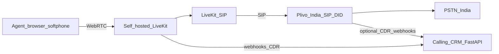

# Cloud Telephony Build Plan (Calling CRM)

Detailed plan to add Agentive-style cloud telephony to Calling CRM: replicate their confirmed LiveKit softphone/SIP architecture, complete solo Udyam KYC, and attach a cost-effective India SIP trunk (Plivo) because Agentive’s PSTN carrier is not publicly disclosed.

**Scope for Phase 1:** cloud telephony only (DID, softphone, CDR, single-level IVR). No WhatsApp, no AI voice.

---

## Verdict (research)

**You can build this as a solo developer** after **Udyam / sole-prop KYC**. Domains alone are not enough for Indian DID.

### What Agentive actually uses (public evidence)

| Layer | Finding | Confidence |
|-------|---------|------------|
| Softphone / WebRTC rooms | Self-hosted [LiveKit](https://docs.livekit.io/telephony/) at `lk.agentive.co.in` (`wss://lk.agentive.co.in/agentive-ws`) | **Confirmed** (voice app JS + HTTP `OK` on LiveKit host) |
| SIP bridge into LiveKit | `sip.voice.agentive.co.in` resolves to **same DigitalOcean IP** as `lk.agentive.co.in` | **Confirmed** (DNS + cert SANs) |
| Product split | `app.agentive.co.in` = chat; `voice.agentive.co.in` = call suite | Confirmed |
| Billing | **Razorpay** | Confirmed |
| WhatsApp | **Meta** WhatsApp Business API | Confirmed |
| PSTN / DID carrier | **Not disclosed** — status shows “Voice network”; terms say licensed Indian operators + SIP trunks | **Unknown** |

We copy Agentive’s **media stack (LiveKit + SIP)**. We use **Plivo** as the India PSTN trunk for cost (public list ~₹0.38/min, DID ~₹200/mo, official LiveKit SIP guides). If Agentive later discloses their carrier, swap the trunk; keep LiveKit.



---

## Part A — Solo feasibility (Udyam path)

**Possible:** yes, as sole proprietor.

| Step | Action | Cost / time |
|------|--------|-------------|
| A1 | Register **Udyam** at [udyamregistration.gov.in](https://udyamregistration.gov.in/) (Aadhaar OTP + PAN; GST optional if under threshold) | Free / same day |
| A2 | Keep proprietor **PAN**, **Aadhaar**, passport photo, address proof ready | — |
| A3 | Create **Plivo India-region** account; submit KYC with **Udyam certificate** | 1–5 business days |
| A4 | Rent 1 India DID after KYC approved | ~₹200/mo + usage |
| A5 | Deploy LiveKit + SIP host (see `deploy/livekit/`) | ~$12–40/mo |

**Blocked if:** only domain + personal ID, no Udyam/trade proof.

**Out of scope for Phase 1:** selling ₹999 multi-tenant SaaS. Phase 1 = **your CRM + your numbers**.

---

## Part B — Third-party registrations (checklist)

### B1. Government / identity

- [ ] Udyam certificate downloaded (PDF)
- [ ] Proprietor PAN + Aadhaar
- [ ] Business display name consistent across Udyam / Plivo / CRM

**Udyam how-to**

1. Open https://udyamregistration.gov.in/ (official only; free)
2. New registration → Aadhaar OTP → PAN
3. Declare sole proprietorship / micro services
4. Skip GSTIN if not registered
5. Download Udyam Registration Certificate PDF

### B2. Plivo (PSTN + DID)

- [ ] Sign up → **India data region** org (cannot change later)
- [ ] Compliance application: upload Udyam (signed/sealed if first app requires)
- [ ] Business type: Direct Brand (not reseller) for own use
- [ ] After Approved: rent India number
- [ ] Enable Voice + recording
- [ ] Create **inbound** + **outbound** SIP trunks → LiveKit SIP URI
- [ ] Whitelist LiveKit SIP host IPs / credentials
- [ ] Fund prepaid wallet (start ₹2,000–5,000)

Docs: [Plivo India number KYC](https://plivo.com/docs/numbers/rent-india-numbers), [LiveKit + Plivo](https://www.plivo.com/livekit/)

### B3. LiveKit (same class as Agentive)

- [ ] Self-host LiveKit Server + LiveKit SIP (Docker) — see `deploy/livekit/`
- [ ] TLS hostnames e.g. `lk.yourdomain.com`, `sip.yourdomain.com`
- [ ] API keys + SIP trunk resources
- [ ] Redis for LiveKit SIP state

### B4. Hosting / DNS / TLS

- [ ] A/AAAA for `lk.*`, `sip.*`, CRM API HTTPS
- [ ] Open UDP/TCP media + SIP ports on VPS firewall
- [ ] Softphone origin allowed for microphone

### B5. Deferred

- Razorpay multi-tenant billing
- Meta WhatsApp
- AI voice STT/LLM/TTS
- Voice broadcast at scale

### B6. Optional Agentive PSTN discovery

Book demo on [agentive.co.in](https://agentive.co.in/) and ask which SIP/CPaaS carries the DID. If answered, swap Plivo trunk; **LiveKit stays**.

---

## Part C — Third-party configurations

### C1. Plivo console

1. Numbers → buy India DID  
2. Inbound trunk → Origination URI = LiveKit SIP endpoint  
3. Outbound trunk → termination + auth  
4. Recording on; webhook = `https://<crm-api>/api/telephony/webhooks/plivo`  
5. Store Auth ID / Token in env only  

### C2. LiveKit

1. SIP inbound trunk (Plivo IP ACL or digest)  
2. SIP outbound trunk (Plivo termination)  
3. Dispatch rule: inbound DID → room `call-<uuid>`  
4. CRM issues agent join tokens  
5. Webhook room/participant events → CRM  

### C3. Calling CRM env

```text
TELEPHONY_PROVIDER=mock|plivo_livekit
LIVEKIT_URL=wss://lk.yourdomain.com
LIVEKIT_API_KEY=
LIVEKIT_API_SECRET=
LIVEKIT_SIP_HOST=sip.yourdomain.com
PLIVO_AUTH_ID=
PLIVO_AUTH_TOKEN=
PLIVO_DID_E164=
TELEPHONY_WEBHOOK_SECRET=
TELEPHONY_MAX_CONCURRENT=5
```

### C4. Compliance

- DND scrub for outbound campaigns  
- Recording notice in IVR greeting  
- Cap concurrent calls (start 2–5)

---

## Part D — CRM product build

**Today:** manual `POST /api/calls/log` only. No softphone.

| Phase | Weeks | Deliverable |
|-------|-------|-------------|
| 0 | 1–2 | Udyam + Plivo KYC + LiveKit hello room |
| 1 | 2–4 | Adapter + webhooks + enriched `calls` |
| 2 | 4–7 | Softphone + click-to-call + recording play |
| 3 | 7–10 | Numbers admin + single-level IVR + missed calls |
| 4 | 10–12 | Auth, caps, reports, tests |

### Code map (implemented in repo)

| Path | Role |
|------|------|
| `backend/telephony/` | Adapter interface, mock, LiveKit+Plivo |
| `backend/routes_telephony.py` | Tokens, originate, webhooks, numbers, IVR |
| `deploy/livekit/` | Docker Compose for LiveKit + SIP + Redis |
| `frontend/src/components/softphone/` | Softphone widget |
| `frontend/src/pages/TelephonyNumbers.jsx` | DID + IVR admin |
| `backend/tests/test_telephony.py` | Adapter + webhook tests |

### Enriched call document fields

Existing manual fields plus:

`direction`, `provider`, `provider_call_id`, `from_number`, `to_number`, `did`, `recording_url`, `talk_sec`, `status` (`ringing`|`answered`|`completed`|`missed`|`failed`), `room_name`, `ivr_digits`

---

## Part E — Costing (solo)

### One-time

| Item | Estimate |
|------|----------|
| Udyam | ₹0 |
| Plivo test credits | ₹2,000–5,000 |
| Dev time | ~6–12 weeks solo |

### Monthly (light usage)

| Item | Estimate |
|------|----------|
| 1 DID | ~₹200 |
| 2,000 min @ ₹0.38–0.70 | ~₹760–1,400 |
| VPS LiveKit | ~₹1,000–3,500 |
| **Total** | **~₹2,000–5,500** |

Heavy outbound dominates cost. ₹999 “unlimited” only works with fair-use caps.

---

## Part F — Acceptance criteria

1. Softphone connects to LiveKit (or mock in local)  
2. Outbound from lead uses DID CLI  
3. Inbound DID rings agent  
4. Hangup opens disposition / ACW  
5. Recording plays in Lead 360  
6. Call History shows direction + duration  
7. Works under `COMPANY_ID` single-tenant seam  

---

## Risks

- Agentive PSTN brand unknown; Plivo is cost-default.  
- Self-hosted LiveKit SIP is ops-heavy (UDP media ports).  
- Plivo may ask for Shop & Establishment if Udyam alone is insufficient.  
- Do not start WhatsApp / AI voice until CDR + softphone are stable.

---

## Registration runbook (solo — copy/paste order)

1. Complete Udyam → save PDF  
2. Create Plivo India org → upload Udyam → wait Approved  
3. Provision VPS Mumbai → clone `deploy/livekit` → set secrets → `docker compose up -d`  
4. Point DNS `lk` / `sip` → VPS; issue TLS certs  
5. Wire Plivo trunks to LiveKit SIP  
6. Set CRM `.env` telephony keys → `TELEPHONY_PROVIDER=plivo_livekit`  
7. Restart API → open Numbers admin → assign DID → test inbound/outbound  
